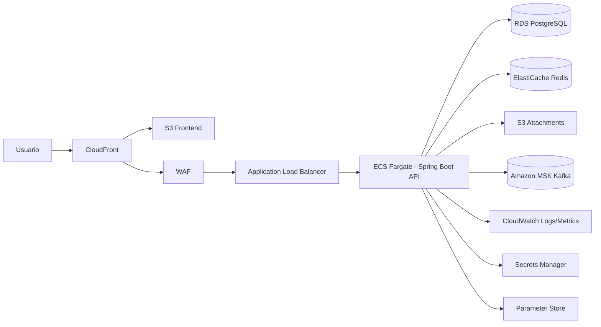

# ETAPA 15 - Arquitetura Alvo AWS (SupportDesk Pro X)

## 1. Front-end hospedado em servico adequado
- **Servico recomendado**: Amazon S3 + Amazon CloudFront
- Motivos:
  - custo baixo para conteudo estatico
  - cache global em edge
  - TLS via ACM
  - invalidação controlada por deploy

## 2. API hospedada em servico adequado
- **Opcao principal**: Amazon ECS Fargate (container do backend Spring Boot)
- **Alternativa**: EKS quando houver necessidade de malha de servicos/multicluster
- Exposicao:
  - Application Load Balancer (ALB)
  - WAF na borda

## 3. Banco em servico gerenciado
- **Amazon RDS for PostgreSQL** (Multi-AZ em producao)
- Parametros essenciais:
  - backups automaticos habilitados
  - Performance Insights
  - criptografia KMS

## 4. Cache em servico gerenciado
- **Amazon ElastiCache for Redis**
- Uso:
  - blacklist de JWT
  - cache de categorias/dashboards

## 5. Armazenamento de anexos
- **Amazon S3** com buckets separados por ambiente
- Padrao de chave sugerido:
  - `attachments/{ticketId}/{uuid}-{filename}`
- Seguranca:
  - SSE-S3 ou SSE-KMS
  - politicas IAM por servico

## 6. Mensageria/stream equivalente
- **Amazon MSK (Managed Streaming for Apache Kafka)**
- Topicos equivalentes:
  - ticket-events
  - comment-events
  - notification-requests
  - sla-alerts
  - audit-events
- Opcao simplificada inicial:
  - Amazon SQS + SNS, se throughput/event ordering for menor

## 7. Secrets/config
- **AWS Secrets Manager** para senhas e chaves sensiveis
- **AWS Systems Manager Parameter Store** para configuracoes nao sensiveis
- Aplicacao le via IAM Role da task ECS

## 8. Logs/monitoramento
- **CloudWatch Logs** para logs estruturados
- **CloudWatch Metrics + Alarms** para SLO/SLA tecnico
- **AWS X-Ray / OpenTelemetry** para tracing distribuido (evolucao)
- Dashboards:
  - latencia p95/p99
  - taxa de erro
  - taxa de eventos em DLQ/falhas outbox

## 9. Desenho logico da arquitetura cloud

## 10. Estrategia de deploy
- Branching:
  - `develop` -> ambiente homologacao
  - `main` -> producao
- Pipeline:
  - build + testes + analise basica
  - build/push de imagem para ECR (ou GHCR)
  - deploy blue/green no ECS via CodeDeploy
- Rollback:
  - revert para tag anterior da imagem
  - invalidação CloudFront quando frontend for revertido

## Preparacao para futura separacao em microsservicos
A organizacao atual ja prepara o split futuro sem perder simplicidade inicial:
- camadas bem definidas por dominio (`service`, `controller`, `repository`, `messaging`)
- eventos de negocio no outbox para desacoplamento
- fronteiras candidatas claras:
  - auth service
  - ticket service
  - notification service
  - audit service
  - user management service
- no monolito atual, cada dominio ja concentra sua regra e contratos (DTOs/eventos), reduzindo friccao de extracao.
